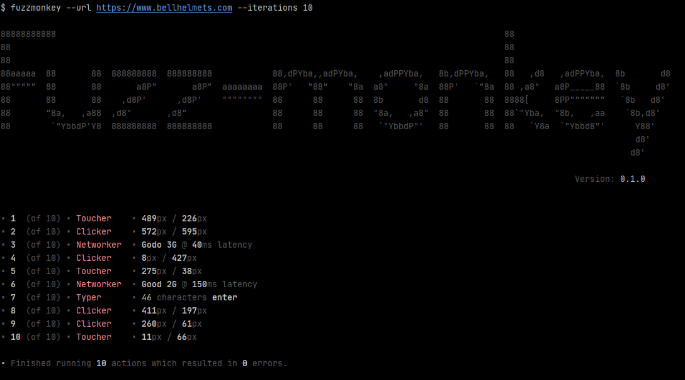

> Robust and versatile headless monkey (fuzz) testing for the web with reproducible steps, error alerts, strategy sharing and many other good things.




It's important to remember that [monkey testing](https://en.wikipedia.org/wiki/Monkey_testing) should be used in conjunction with smarter tests such as [integration tests](https://en.wikipedia.org/wiki/Integration_testing).

## Getting Started
```console
fuzzmonkey --url https://bellhelmets.com/
```
